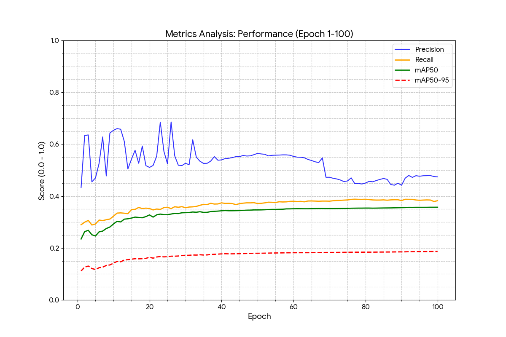
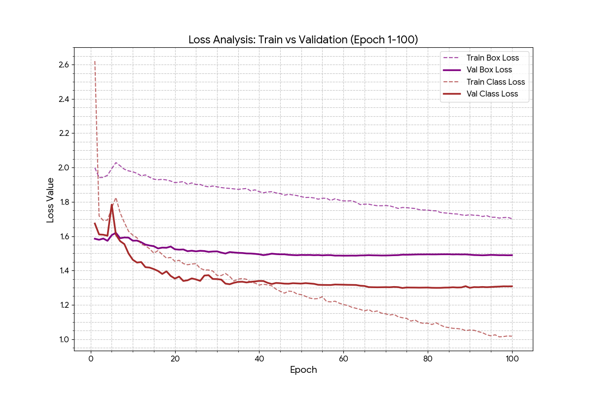

# SAMDEF: High-Performance Edge Platform for ISR

---

## Table of Contents
- [Overview](#overview)
- [Architecture](#architecture)
- [Workflow & Data Flow](#workflow--data-flow)
- [Modular Apps](#modular-apps)
  - [Deployment Modules](#deployment-modules)
  - [Training Modules](#training-modules)
- [Tech Stack](#tech-stack)
- [Usage](#usage)
- [License](#license)

---

## Overview

**SAMDEF** is a comprehensive, modular monolith system for processing Intelligence, Surveillance, and Reconnaissance (ISR) data using AI-driven object detection. The system is split into deployment and training modules, enabling real-time geospatial imagery processing and continuous model improvement through robust data pipelines.

- **Deployment modules** handle live GeoTIFF image processing, object detection, and visualization.
- **Training modules** manage data preparation and model training to enhance detection accuracy.

  

## Architecture

SAMDEF is a **modular monolith**: each functional component is a decoupled module within a unified codebase. This design enables rapid development and deployment while maintaining clear separation of concerns.

**Key architectural highlights:**
- 🧩 **Modular Monolith:** All core logic in a single codebase, each module with a distinct function.
- 🔗 **Decoupled Modules:** Loosely coupled for maintainability and independent development.
- 🔄 **Zenoh Peer Communication:** All modules communicate via Zenoh in peer mode—no centralized brokers or registries.
- ⚡ **High Performance:** Rust for deployment/data processing, Python for AI/ML training.
- 🗄️ **Database Integration:** PostgreSQL for persistent storage of detection results and metadata.

  

## Workflow & Data Flow

The SAMDEF workflow consists of two main phases: **training** and **deployment**.

### Training Phase
1. Raw ISR data is ingested and labeled using the **Ingestor** module.
2. Labeled datasets are fed into the **Model Trainer** for YOLO model training.
3. Trained models are exported in ONNX format for deployment.

  

### Deployment Phase
1. GeoTIFF images are received and processed by the **Detector** module using virtual tiling.
2. Detections are performed on GPU using ONNX models.
3. Results are stored in the database via **DB Processor**.
4. **Post Processor** visualizes detections by annotating images with bounding boxes.

  

Data flows from raw ingestion through training to deployment, with feedback loops for model improvement.

  

## Modular Apps

### Deployment Modules

#### Detector
A Rust-based module for object detection on large GeoTIFF images. Utilizes virtual tiling for high-resolution geospatial data, running inference on CUDA-enabled GPUs with YOLOv8 ONNX models. Outputs detection results in JSON with global coordinates.

**Key features:**
- Virtual tiling for efficient processing
- GPU-accelerated inference
- Overlapping tiles to avoid edge artifacts

#### Post Processor
A Rust module for visualizing detection results. Reads JSON outputs from Detector, loads original GeoTIFFs, and draws class-specific bounding boxes. Saves annotated images for review and analysis.

**Key features:**
- High-fidelity image annotation
- Class-specific color coding
- Efficient handling of large images

#### DB Processor
A Rust module managing database operations for detection results. Uses PostgreSQL for metadata storage and Zenoh peer-to-peer communication for real-time data exchange.

**Key features:**
- Asynchronous database interactions
- Real-time data publishing via Zenoh peer mode
- Error handling and logging

---

### Training Modules

#### Ingestor
A Rust module for data ingestion and preparation. Provides tools for dataset balancing, label parsing, image labeling, and utilities for processing raw ISR data into labeled datasets.

**Key features:**
- Automated dataset balancing
- Label format conversion
- Image preprocessing utilities

#### Model Trainer
A Python module built on the YOLO framework for training object detection models. Supports various YOLO variants and includes modules for training runs, constraint files, and metric extraction.

**Key features:**
- Configurable training pipelines
- Performance monitoring and logging
- Model export to ONNX format

  

## Tech Stack

- **Languages:** Rust (deployment, data processing), Python (AI/ML training)
- **Frameworks:** YOLO (training), ONNX (inference)
- **Databases:** PostgreSQL
- **Messaging:** Zenoh (peer mode)
- **Hardware Acceleration:** CUDA GPUs
- **Image Formats:** GeoTIFF

## Usage

- **Start training:** Run the Model Trainer with appropriate datasets.
- **Deploy modules:** Launch Detector, DB Processor, and Post Processor in sequence.
- **Monitor:** Use logs and Zenoh topics for real-time monitoring.

## License

This project is **proprietary software**. All rights reserved. No part of this software may be used, reproduced, or distributed without explicit written permission from the copyright holder.