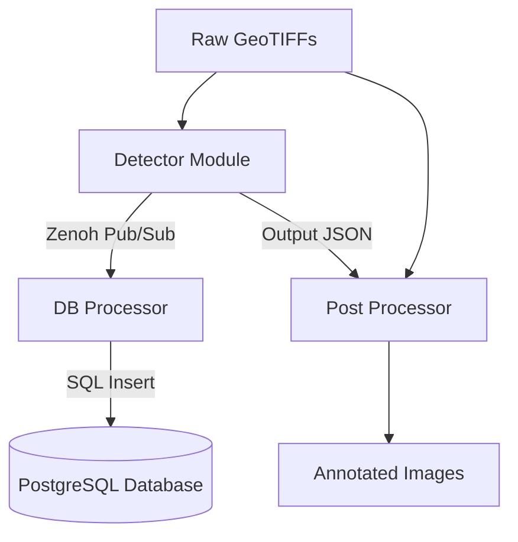

# SAMDEF: High-Performance Edge Computer Vision System

> **Module Documentation:** For deep technical dives into the architecture, please see the individual module docs:
> [Detector](docs/architecture/detector.md) | [DB Processor](docs/architecture/dbprocessor.md) | [Ingestor](docs/architecture/ingestor_training.md) | [Model Trainer](docs/architecture/model_trainer.md)

---

## Table of Contents
- [Overview](#overview)
- [Use Cases](#use-cases)
- [Inference Examples](#inference-examples)
- [Architecture](#architecture)
- [Workflow & Data Flow](#workflow--data-flow)
- [Modular Apps](#modular-apps)
- [Tech Stack](#tech-stack)
- [Installation & Setup](#installation--setup)
- [Usage](#usage)

---

## Overview

**SAMDEF** is a high-performance, modular monolith platform designed for efficient edge computer vision and massive-scale image processing. Optimized for on-premise execution without reliance on cloud or SaaS infrastructure, it enables high-throughput automated object detection on exceptionally large imagery (such as massive GeoTIFFs).

The system automates the data-intensive groundwork of transforming raw pixels into structured, geospatial knowledge. By leveraging a Zero-Wait GPU Pipeline, it ensures that while one batch of imagery is analyzed, the next is already being pre-processed in memory, maximizing hardware utilization. It provides operators with the critical "What" and "Where" by mapping every detected object (e.g., vehicles, infrastructure, specific assets) to its exact Global Geospatial Coordinates and suppressing duplicates via Spatial Grid NMS.

By delivering high-fidelity metadata and object locations directly to a local database in near real-time, SAMDEF acts as a high-speed programmatic scout for environments that are far too large for manual human review.

## Use Cases

SAMDEF is optimized for massive geospatial and satellite imagery—processing directly on the edge, not on a remote server—making it highly effective across defense, civilian, and commercial applications.

### Off-Grid Surveillance & Remote Operations
SAMDEF is engineered for remote environments where cloud connectivity is unavailable or compromised. It is highly effective for processing satellite or high-altitude drone imagery directly at the edge:
- **Fully Offline Execution:** Operates 100% locally on field hardware, requiring absolutely no internet connection to process massive GeoTIFFs.
- **High-Altitude Analytics:** Rapidly scans imagery from drones or satellites, converting raw pixels into actionable intelligence in near real-time.
- **Geospatial Contextualization:** Automatically maps detected objects of interest (e.g., vehicles, equipment, structures) to exact global coordinates, providing operators with instant situational awareness in the field.

### Civilian and Commercial Applications
- **Urban & Town Planning:** Automating the detection of buildings, road networks, and infrastructure changes over time to monitor urban sprawl and inform zoning decisions.
- **Traffic & Logistics Analysis:** Identifying and counting vehicles across massive areas (e.g., highways, shipping ports, distribution centers) to analyze traffic density, parking utilization, and supply chain activity.
- **Disaster Response & Damage Assessment:** Rapidly scanning affected regions to locate structural damage, blocked roads, and temporary settlements after natural disasters.
- **Environmental & Maritime Monitoring:** Tracking changes in vegetation, monitoring coastal erosion, or detecting illicit maritime activity.
- **Agriculture:** Surveying expansive farmlands to identify crop health boundaries, water usage, and structural assets (like silos and tractors).

- **Deployment modules** handle huge GeoTIFF image processing, object detection, and visualization.
- **Training modules** manage data preparation and model training to enhance detection accuracy.

## Inference Examples

Below are embedded examples, with each original image shown above its annotated version for visual comparison.

**Original:**  
  
**Annotated:**  


**Original:**  
  
**Annotated:**  


**Original:**  
  
**Annotated:**  


**Original:**  
  
**Annotated:**  


**Original:**  
  
**Annotated:**  


**Original:**  
  
**Annotated:**  


**Original:**  
  
**Annotated:**  


**Original:**  
  
**Annotated:**  


**Original:**  
  
**Annotated:**  


Below is a table of clickable links to the original and annotated images, shown side by side for easy comparison.
To view the images at full size, right-click the link and select "Open link in new tab."

| Original Image | Annotated Image |
|---|---|
| [1434.png](https://shatadalsamui.github.io/images/1434.png) | [1434_annotated.png](https://shatadalsamui.github.io/images/1434_annotated.png) |
| [1464.png](https://shatadalsamui.github.io/images/1464.png) | [1464_annotated.png](https://shatadalsamui.github.io/images/1464_annotated.png) |
| [1471.png](https://shatadalsamui.github.io/images/1471.png) | [1471_annotated.png](https://shatadalsamui.github.io/images/1471_annotated.png) |
| [2016.png](https://shatadalsamui.github.io/images/2016.png) | [2016_annotated.png](https://shatadalsamui.github.io/images/2016_annotated.png) |
| [2342.png](https://shatadalsamui.github.io/images/2342.png) | [2342_annotated.png](https://shatadalsamui.github.io/images/2342_annotated.png) |
| [2363.png](https://shatadalsamui.github.io/images/2363.png) | [2363_annotated.png](https://shatadalsamui.github.io/images/2363_annotated.png) |
| [2411.png](https://shatadalsamui.github.io/images/2411.png) | [2411_annotated.png](https://shatadalsamui.github.io/images/2411_annotated.png) |
| [2473.png](https://shatadalsamui.github.io/images/2473.png) | [2473_annotated.png](https://shatadalsamui.github.io/images/2473_annotated.png) |
| [2613.png](https://shatadalsamui.github.io/images/2613.png) | [2613_annotated.png](https://shatadalsamui.github.io/images/2613_annotated.png) |

### Inference Timing Results (YOLO26s, FP16)

- **Dataset:** 281 images (~3000×3000 pixels each, 0.3m GSD)
- **Total area:** 227.61 km²
- **Hardware Profile:** CUDA Core utilization maintained at 75-85%. VRAM footprint remained under 1GB for Batch Size 4.

| Provider | Model        | Batch Size | Total Time (sec) | Time per km² (sec) | Notes                        |
|----------|--------------|------------|------------------|--------------------|------------------------------|
| GPU      | YOLO26s FP16 | 4          | 52               | 0.23               | RTX 4060, full FP16 accel    |
| CPU      | YOLO26s FP16 | 4          | 999              | 4.39               | i9-13900HX, FP16 emulated    |

**Specs:** i9-13900HX, 48GB RAM, RTX 4060  
**Dataset:** 281 images, 3000×3000 px, 0.3m GSD, 227.61 km² total

- **Interpretation:**  
  - CPU is ~19x slower than GPU for this workload, which matches expectations for FP16 emulation on a high-end CPU.
  - Time per km² is a useful metric for scaling to larger areas or comparing with other systems.
  - Both CPU and GPU performance are strong for a lightweight model like YOLO26s.

### Model Metrics (Validation Set)

| Class | Images | Instances | Precision (P) | Recall (R) | mAP50 | mAP50-95 |
|---|---|---|---|---|---|---|
| all | 1289 | 127500 | 0.550 | 0.427 | 0.442 | 0.241 |
| Light-Vehicle | 697 | 50191 | 0.713 | 0.783 | 0.770 | 0.349 |
| Boxy-Truck | 542 | 4851 | 0.512 | 0.402 | 0.425 | 0.227 |
| Long-Trucks | 502 | 4820 | 0.473 | 0.350 | 0.363 | 0.180 |
| Small-Boat | 84 | 748 | 0.629 | 0.683 | 0.650 | 0.331 |
| Large-Ship | 80 | 315 | 0.479 | 0.302 | 0.360 | 0.193 |
| Fixed-Wing | 74 | 200 | 0.872 | 0.714 | 0.803 | 0.462 |
| Helicopter | 4 | 5 | 0.277 | 0.200 | 0.197 | 0.122 |
| Building | 783 | 60680 | 0.583 | 0.655 | 0.635 | 0.328 |
| Storage-Tank | 78 | 407 | 0.719 | 0.369 | 0.468 | 0.271 |
| Railway | 24 | 586 | 0.760 | 0.691 | 0.712 | 0.428 |
| Engineering-Machinery | 264 | 1433 | 0.537 | 0.426 | 0.457 | 0.260 |
| Tower-Pylon | 94 | 160 | 0.802 | 0.388 | 0.452 | 0.295 |
  
## Folder Structure
### apps_deploy
```
apps_deploy/
├── db_processor/
│   ├── docs/
│   ├── src/
│   │   └── modules/
├── detector/
│   ├── docs/
│   ├── model/
│   ├── src/
│   │   └── modules/
├── post_processor/
│   ├── src/
```
### apps_training
```
apps_training/
├── ingestor/
│   ├── src/
│   │   └── modules/
├── yolo_model_trainer/
│   ├── build/
│   ├── src/
│   │   ├── cortex/
│   │   ├── models/
│   │   ├── samdef_brain.egg-info/
│   │   ├── utils/
│   │   └── SAMDEF_ISR/
│   ├── venv/
````

## Architecture

SAMDEF is structured as a modular monolith: all core logic resides in a unified codebase, with each module responsible for a distinct function. Modules are decoupled for maintainability and communicate via Zenoh in peer-to-peer mode, ensuring efficient and scalable data exchange.



**Key architectural highlights:**
- **Modular Monolith:** Unified codebase with clear module boundaries.
- **Decoupled Modules:** Each module can be developed and maintained independently.
- **Zenoh Peer Communication:** All inter-module communication is handled via Zenoh in peer mode.
- **High Performance:** Rust for deployment/data processing, Python for AI/ML training.
- **Database Integration:** PostgreSQL for persistent storage of detection results and metadata.

---

## Workflow & Data Flow

The SAMDEF workflow consists of two main phases: **training** and **deployment**.

### Training Phase
1. Raw imagery data is ingested and labeled using the Ingestor module.
2. Labeled datasets are used by the Model Trainer for YOLO model training.
3. Trained models are exported in ONNX format for deployment.

### Deployment Phase
1. GeoTIFF images are processed by the Detector module using virtual tiling.
2. Detections are performed on GPU using ONNX models.
3. Results are stored in the database via DB Processor.
4. Post Processor visualizes detections by annotating images with bounding boxes.

---

## Modular Apps

### Deployment Modules

#### detector
- **Purpose:** High-performance object detection on large-scale geospatial imagery (GeoTIFF).
- **How it works:** 
  - Uses a producer-consumer pattern with virtual tiling to break large images into manageable tiles.
  - Tiles are preprocessed and batched for GPU inference using a YOLOv26s ONNX model.
  - Results are post-processed to global coordinates and output as JSON.
- **Key features:** Virtual tiling, parallel CPU preprocessing, GPU batching, global coordinate mapping, efficient memory usage.
- **Folder structure:**
  - `src/`: Rust source code for tiling, inference, and postprocessing.
  - `model/`: Contains the ONNX model used for inference.
  - `docs/`: Architecture and planning documentation.

#### post_processor
- **Purpose:** Visualization of detection results.
- **How it works:** 
  - Reads JSON outputs from the detector.
  - Loads original GeoTIFF images and draws bounding boxes with class-specific colors.
  - Saves annotated images for review and analysis.
- **Key features:** High-fidelity image annotation, class-specific color coding, efficient handling of large images.
- **Folder structure:**
  - `src/`: Rust source code for image annotation and visualization.

#### db_processor
- **Purpose:** Database operations for detection results.
- **How it works:** 
  - Stores detection metadata in PostgreSQL.
  - Publishes and receives data via Zenoh peer-to-peer communication.
  - Enables querying and persistence of historical detections.
- **Key features:** Asynchronous database interactions, real-time data publishing, robust error handling.
- **Database Schema:** Tables and relationships are defined in `src/modules/schema/init.sql`.
- **Folder structure:**
  - `src/`: Rust source code for database and Zenoh integration.
  - `docs/`: Documentation for database schema and integration.

---

### Training Modules

#### ingestor
- **Purpose:** Data ingestion and preparation for model training.
- **How it works:** 
  - Processes raw imagery data, balances datasets, parses and converts labels, and prepares images.
  - Outputs labeled datasets suitable for machine learning.
- **Key features:** Automated dataset balancing, label format conversion, image preprocessing utilities.
- **Folder structure:**
  - `src/`: Rust source code for data ingestion, balancing, and preprocessing.

#### yolo_model_trainer
- **Purpose:** Training of object detection models using YOLO.
- **How it works:** 
  - Trains YOLO models on labeled datasets.
  - Supports exporting trained models to ONNX format for deployment.
  - Includes scripts for diagnostics, metric extraction, and model export.
- **Key features:** Configurable training pipelines, performance monitoring, ONNX export, integration with ingestor outputs.
- **Folder structure:**
  - `src/`: Python source code for training, evaluation, and export.
  - `build/`: Build artifacts and logs.
  - `venv/`: Python virtual environment for dependencies.

---


## Tech Stack

- **Languages:** Rust (deployment, data processing), Python (AI/ML training)
- **Frameworks:** YOLO (training), ONNX (inference)
- **Databases:** PostgreSQL
- **Messaging:** Zenoh (peer mode)
- **Hardware Acceleration:** CUDA GPUs
- **Image Formats:** GeoTIFF

---

## Installation & Setup

### System Dependencies

> **Operating System:** SAMDEF is designed and optimized specifically for Linux-based operating systems (Ubuntu/Debian recommended).

SAMDEF requires several OS-level dependencies for massive-scale image processing, database operations, and GPU acceleration. Ensure you have the following installed:
- **Core Languages:** Rust (via `rustup`), Python 3.9+ (with `python3-venv`), and PostgreSQL.
- **Hardware Acceleration:** CUDA Toolkit (11.x or 12.x) and cuDNN. *(Note: The ONNX Runtime binaries are fetched automatically by the Rust build process, but the host system must have CUDA/cuDNN installed).*
- **C Libraries:** `libgdal-dev` (for GeoTIFF parsing), `libturbojpeg0-dev` (for high-speed image encoding/decoding), and `pkg-config`.

### Setup Instructions
1. **Environment Variables:** 
   - Navigate to each microservice (`apps_deploy/detector`, `apps_deploy/post_processor`, `apps_deploy/db_processor`, `apps_training/ingestor`, `apps_training/yolo_model_trainer`).
   - Copy the `.env.example` file to `.env` (`cp .env.example .env`).
   - Update the paths and database credentials in the `.env` file to match your local system.
3. **Database Initialization:** Ensure your PostgreSQL instance is running. The `db_processor` will automatically initialize the schema on its first run.
4. **Python Dependencies:** For the YOLO trainer, set up the virtual environment:
   ```bash
   cd apps_training/yolo_model_trainer
   python3 -m venv venv
   source venv/bin/activate
   pip install -e .
   ```

---

## Usage

### Deployment Pipeline
To run the main detection and deployment pipeline, launch the Rust microservices:

1. **Start the DB Processor (Zenoh Listener):**
   ```bash
   cd apps_deploy/db_processor
   cargo run --release
   ```
2. **Start the Detector (GPU Inference):**
   ```bash
   cd apps_deploy/detector
   cargo run --release
   ```
3. **Run the Post Processor (Image Annotation):**
   ```bash
   cd apps_deploy/post_processor
   cargo run --release
   ```

### Training Pipeline
To train new models on custom datasets:

1. **Ingest Data:**
   ```bash
   cd apps_training/ingestor
   cargo run --release
   ```
2. **Train Model:**
   ```bash
   cd apps_training/yolo_model_trainer
   source venv/bin/activate
   python src/main.py train
   ```

---

